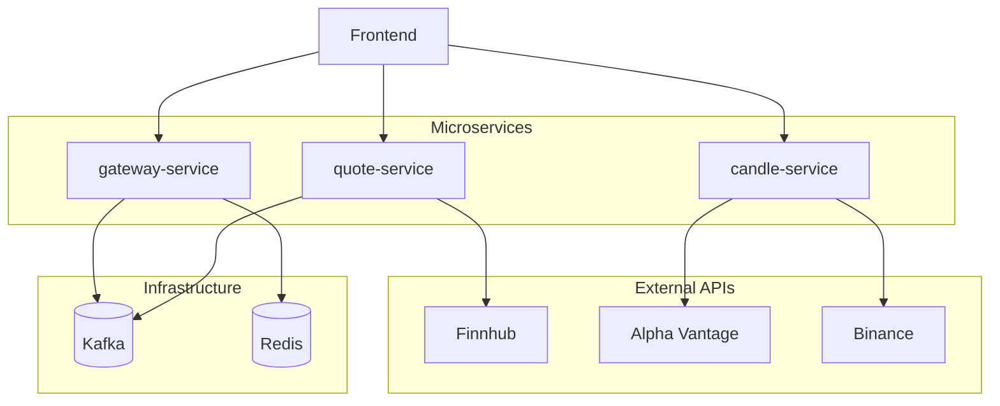

# Real-Time Market Data Platform (Backend)

Real-time stock and cryptocurrency market data platform built with Spring Boot microservices (backend) and React (frontend).

The system uses Apache Kafka for event streaming, Redis for real-time caching, and WebSocket for live data delivery to the frontend dashboard.

---

# Microservices Architecture

## quote-service

### Responsibilities
- Receive real-time price streams
- Publish market price events to Kafka
- Provide REST APIs for market data

### APIs
- Company profile
- Financial metrics
- Analyst recommendations
- Market news

### Data Sources
- Finnhub API
- Binance API

---

## candle-service

### Responsibilities
- Provide historical candlestick (K-line) data
- Serve chart data for frontend visualization

### Data Source
- AlphaVantage API

---

## gateway-service

### Responsibilities
- Central API Gateway
- Route requests to microservices
- Provide REST and WebSocket endpoints
- Unified API entry point for frontend

---
# Project Structure

```text
real-time-market-data-platform
│
├─ quote-service                     # Real-time market data ingestion service
│  │                                 # Connects to external market APIs and produces streaming events
│  │
│  ├─ config                         # Configuration classes
│  │   └─ FinnhubProperties.java     # Finnhub API configuration (API key, endpoint)
│  │
│  ├─ controller                     # REST API endpoints
│  │   ├─ CompanyController.java     # API for company profile information
│  │   ├─ MetricController.java      # API for financial metrics (PE, EPS, etc.)
│  │   ├─ NewsController.java        # API for market news
│  │   ├─ QuoteController.java       # API for latest market quotes
│  │   └─ RecommendationController.java # API for analyst recommendations
│  │
│  ├─ dto                            # Data Transfer Objects for API responses
│  │   ├─ CompanyProfileDTO.java
│  │   ├─ MetricDTO.java
│  │   ├─ NewsDTO.java
│  │   ├─ RawQuoteDTO.java
│  │   └─ RecommendationDTO.java
│  │
│  ├─ service                        # Business logic layer
│  │   ├─ FinnhubRestService.java    # Calls Finnhub REST API
│  │   └─ QuoteProducer.java         # Publishes real-time quote events to Kafka
│  │
│  └─ websocket
│      └─ FinnhubWebSocketClient.java # Receives real-time quote stream from Finnhub WebSocket
│
│
├─ candle-service                    # Historical market data service
│  │                                 # Provides candlestick (OHLC) data for charting
│  │
│  ├─ config
│  │   ├─ AlphaVantageProperties.java # AlphaVantage API configuration
│  │   └─ CorsConfig.java             # CORS configuration for frontend access
│  │
│  ├─ controller
│  │   └─ CandleController.java       # REST API to retrieve candlestick data
│  │
│  ├─ dto
│  │   └─ CandleBar.java              # OHLC candlestick data model
│  │
│  └─ service
│      └─ AlphaVantageService.java    # Calls AlphaVantage API to fetch candle data
│
│
├─ gateway-service                   # API Gateway service
│  │                                 # Central entry point for frontend requests
│  │                                 # Handles WebSocket streaming and Redis caching
│  │
│  ├─ config
│  │   ├─ CorsConfig.java             # Cross-Origin configuration
│  │   ├─ RedisConfig.java            # Redis cache configuration
│  │   └─ WebSocketConfig.java        # WebSocket endpoint configuration
│  │
│  ├─ controller
│  │   └─ PriceController.java        # REST API for retrieving cached price data
│  │
│  ├─ dto
│  │   └─ RawQuoteDTO.java            # Quote data format used across services
│  │
│  └─ service
│      ├─ PriceCacheService.java      # Reads/writes real-time prices to Redis cache
│      └─ QuoteConsumer.java          # Kafka consumer receiving market price events
│
│
├─ docker-compose.yml                # Infrastructure services (Kafka, Redis)
│
└─ infrastructure
   ├─ Kafka                          # Event streaming platform for real-time data
   └─ Redis                          # In-memory cache for fast market data access
```




- `quote-service` is responsible for real-time quote subscription, retrieving company information, financial metrics, news, and recommendation data, and publishing real-time quotes to Kafka.

- `gateway-service` is responsible for consuming quote events from Kafka, storing the latest price data in Redis cache, and delivering data to the frontend through REST APIs and WebSocket.

- `candle-service` is responsible for providing candlestick data, using Alpha Vantage for stock market data and Binance for cryptocurrency data.

- `Kafka` serves as the event bus for real-time quote streaming, while `Redis` serves as the cache layer for the latest price data.


---
# Technology Stack

## Backend

- Java
- Spring Boot
- Spring WebSocket
- Spring Kafka

## Infrastructure

- Apache Kafka
- Redis
- Docker

## Architecture

- Microservices Architecture
- Event-Driven Architecture

---

# Features

- Real-time stock and crypto price streaming
- Interactive candlestick charts
- Company profile and financial metrics
- Analyst recommendation aggregation
- Market news integration
- Event-driven microservice architecture

## Architecture Highlights

- Microservices architecture
- Event-driven system design
- Real-time market data streaming
- Kafka-based event pipeline
- WebSocket live dashboard updates
- Redis real-time cache layer


